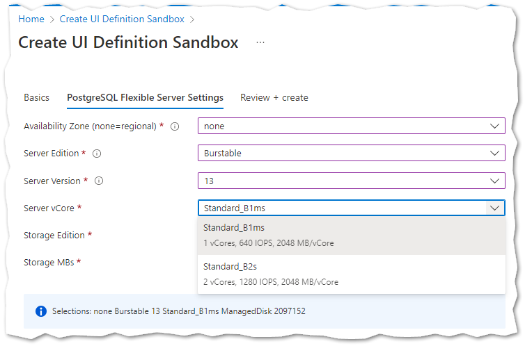

# Using ArmApiControl to query Azure PostgreSQL Flexible Server location-based capabilities

This createUiDefinition.json example shows how to use the [ArmApiControl](https://docs.microsoft.com/azure/azure-resource-manager/managed-applications/microsoft-solutions-armapicontrol) to query and display [PostgreSQL Flexible Server location-based capabilities](https://docs.microsoft.com/rest/api/postgresql/flexibleserver(preview)/location-based-capabilities/execute?tabs=HTTP) within [DropDown](https://docs.microsoft.com/azure/azure-resource-manager/managed-applications/microsoft-common-dropdown) UI elements.

See related video at [Azure createUiDefinition.json ArmApiControl using PostgreSQL Flexible Server location-based capabilities API](https://arsenvlad.medium.com/azure-createuidefinition-json-9bf895642f14)

Azure PostgreSQL Flexible Server service has different capabilities that are based on the Azure subscription and region where it is being deployed. For example, a given region may only allow deployment within specific zones for a given subscription or only support specific PostgreSQL server versions. If Azure Application needs to deploy a PostgreSQL Flexible Server, it needs to be able to show only the appropriate location-based capabilities to the user  to avoid deployment-time failures that use features that are not available in the selected region and subscription.

## Steps

* Copy [postgresql-flexibleserver-selectors.json](postgresql-flexibleserver-selectors.json) into [Create UI Definition Sandbox](https://portal.azure.com/?feature.customPortal=false&#blade/Microsoft_Azure_CreateUIDef/SandboxBlade)
* Try various regions to see how available options change based on the region selected
  * East US - for all options
  * West US - for regional only without zones
  * West US 2 - for no availability of PostgreSQL Flexible Server
* Take a look at the code to see how contains() and an array are used to filter the drop downs to narrow down the options that the location-based capabilities API returns to ones that you want to have (e.g., say only GeneralPurpose instead of Burstable tier and version 13 only, etc.)

## Screenshots

### Available

### Not Available

### Outputs

## Links

https://portal.azure.com/#create/Microsoft.Template/uri/https%3A%2F%2Fraw.githubusercontent.com%2Farsenvlad%2Fcreateuidefinition-examples%2Fmain%2Fpostgresql-flexible-server%2Ftemplate.json/createUIDefinitionUri/https%3A%2F%2Fraw.githubusercontent.com%2Farsenvlad%2Fcreateuidefinition-examples%2Fmain%2Fpostgresql-flexible-server%2Fpostgresql-flexibleserver-selectors.json
